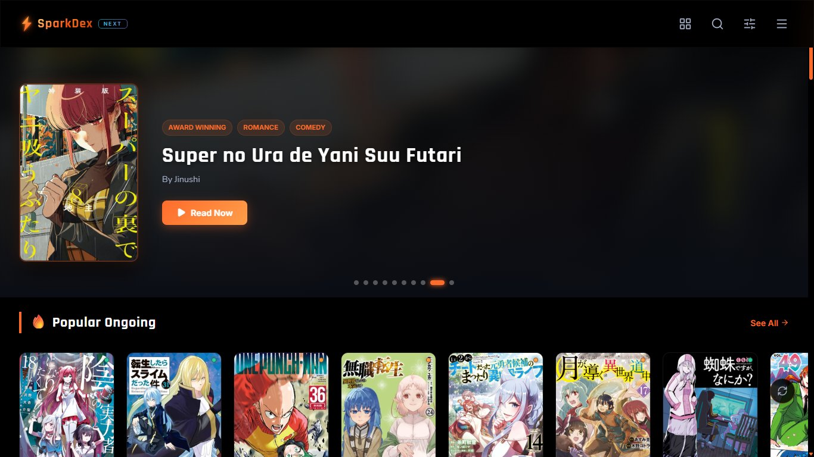
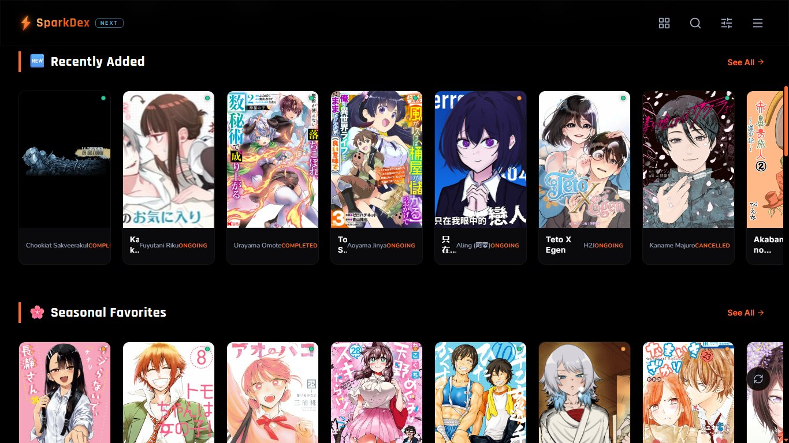
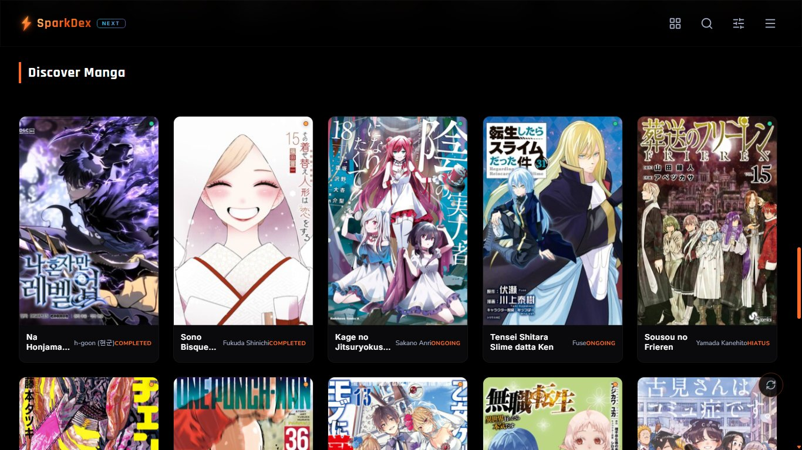
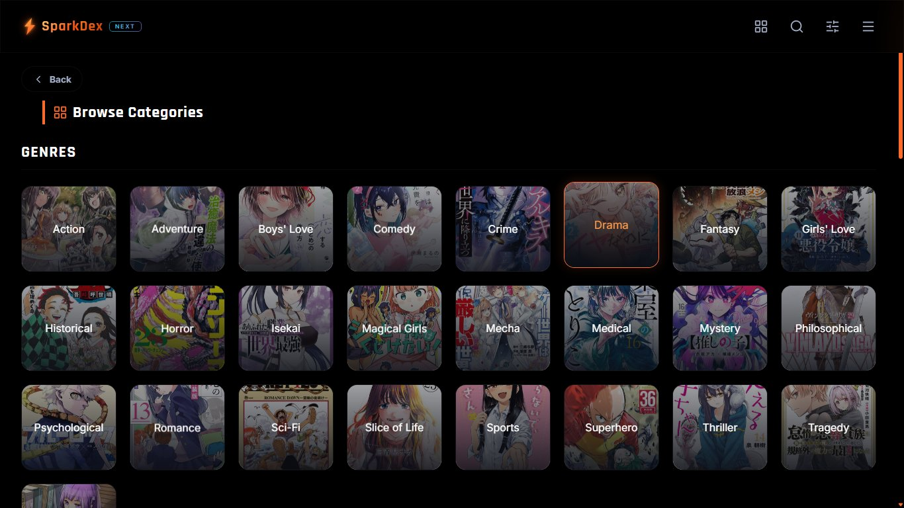
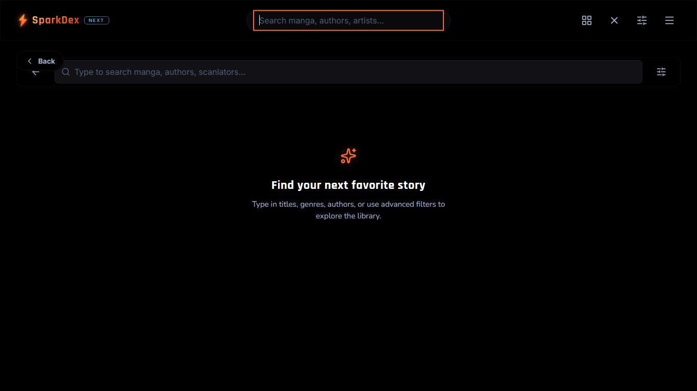
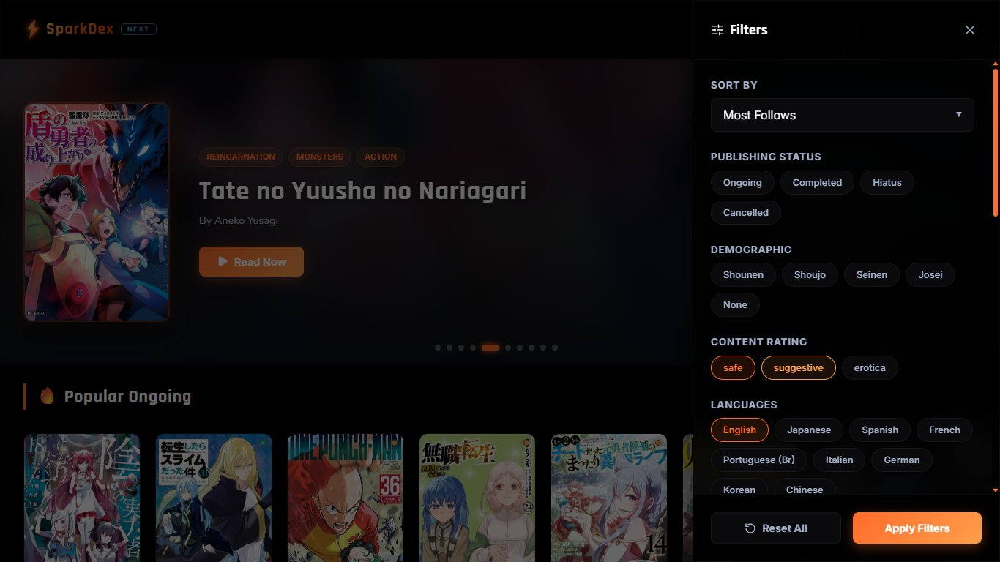
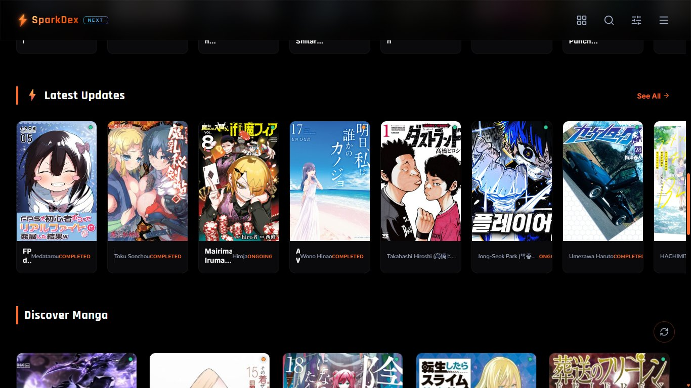
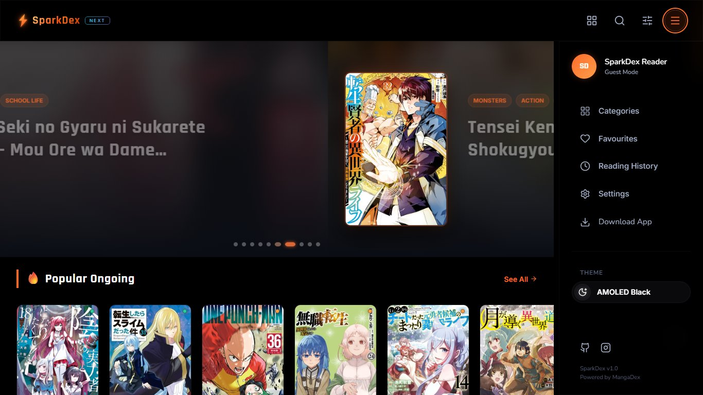

<div align="center">

# ⚡ SparkDexNext

**A premium, open-source web client for MangaDex**

*Ad-free. Fast. Beautiful. Yours.*

[](https://react.dev/)
[](https://vitejs.dev/)
[](https://nodejs.org/)
[](https://github.com/pmndrs/zustand)
[](https://tanstack.com/query)
[](LICENSE)

</div>

---

SparkDexNext is a high-performance MangaDex client built for readers who want a clean, distraction-free experience. It features a glassmorphic UI, smart chapter progress tracking, and a Node.js proxy server that resolves CORS issues and ISP-level DNS blocks out of the box.

---

## Table of Contents

- [Screenshots](#screenshots)
- [Features](#features)
- [Tech Stack](#tech-stack)
- [Getting Started](#getting-started)
- [Project Structure](#project-structure)
- [Contributing](#contributing)
- [License](#license)

---

## Screenshots

<table>
  <tr>
    <td align="center"><b>Home / Hero Carousel</b></td>
    <td align="center"><b>Curated Sections</b></td>
  </tr>
  <tr>
    <td></td>
    <td></td>
  </tr>
  <tr>
    <td align="center"><b>Discover Manga Grid</b></td>
    <td align="center"><b>Browse Categories</b></td>
  </tr>
  <tr>
    <td></td>
    <td></td>
  </tr>
  <tr>
    <td align="center"><b>Search</b></td>
    <td align="center"><b>Advanced Filters</b></td>
  </tr>
  <tr>
    <td></td>
    <td></td>
  </tr>
  <tr>
    <td align="center"><b>Latest Updates & Discover</b></td>
    <td align="center"><b>Side Navigation & Theme</b></td>
  </tr>
  <tr>
    <td></td>
    <td></td>
  </tr>
</table>

---

## Features

### UI/UX

- **Glassmorphic design** — blur effects, micro-animations, and a polished dark aesthetic throughout
- **Three color themes** — Dark, AMOLED (pure black, OLED-optimized), and Dim
- **Responsive layout** — slide-out sidebar on desktop, bottom navigation bar on mobile
- **Touch-optimized filters** — a full filter drawer tuned for both mouse and touch interactions

### Reader

- **Smooth pagination** — keyboard shortcut support (Left / Right arrows)
- **Autoplay + speed controls** — adjustable auto-scroll and page-turning rates
- **Three image quality modes** — Standard, High, and Data Saver for bandwidth flexibility
- **Scroll position tracking** — resumes reading from your exact position, not just the last chapter

### Library & Preferences

- **Favorites / Bookmarks** — save manga to a local library for quick access
- **Reading history** — timestamped log of recently read titles and chapters
- **Title language toggle** — display titles in Romaji, English, or native script
- **Persisted state** — settings, history, and library survive browser restarts via Zustand + LocalStorage

### Proxy Backend

- **DNS override** — resolves MangaDex domains via Google (8.8.8.8) and Cloudflare (1.1.1.1), bypassing ISP-level blocks
- **Automatic URL rewriting** — proxies chapter image URLs directly, eliminating CORS errors
- **Cache optimization** — sets `Cache-Control: public, max-age=604800, immutable` to minimize repeat asset load times

---

## Tech Stack

| Layer | Technology |
|---|---|
| UI Framework | React 18 (hooks, functional components) |
| Build Tool | Vite 5 |
| Routing | React Router Dom v6 |
| State Management | Zustand (with LocalStorage persistence) |
| Data Fetching | TanStack React Query v5 |
| Icons | Lucide React |
| Backend | Node.js + Express |
| Proxy / DNS | Custom `dns.Resolver` with CORS middleware |

---

## Getting Started

### Prerequisites

- [Node.js](https://nodejs.org) v18 or higher
- `npm` (bundled with Node.js)

### Installation

```bash
# 1. Clone the repo
git clone https://github.com/YOUR_GITHUB_USERNAME/sparkdexnext.git
cd sparkdexnext

# 2. Install all dependencies (root + frontend + backend)
npm run install-all
```

### Development

Run both the frontend and backend proxy server concurrently with hot-reloading:

```bash
npm run dev
```

| Service | URL |
|---|---|
| Frontend | `http://localhost:5173` |
| Backend Proxy | `http://localhost:3001` |

---

## Project Structure

```
sparkdexnext/
├── package.json               # Monorepo root scripts
│
├── server/                    # Express backend
│   ├── index.js               # DNS resolver, proxy logic, CORS setup
│   └── package.json
│
└── frontend/                  # React application
    ├── index.html
    ├── vite.config.js
    └── src/
        ├── main.jsx           # App entry point
        ├── App.jsx            # Root routing and layout
        ├── components/        # Shared UI components (Navbar, Reader, TopBar, etc.)
        ├── pages/             # Route-level views (Home, Search, Favourites, History)
        ├── store/             # Zustand stores (settings, favourites, history)
        └── styles/            # Global CSS, design tokens, animations
```

---

## Contributing

Contributions are welcome. To get started:

1. Fork the repository
2. Create a feature branch: `git checkout -b feature/your-feature`
3. Commit your changes: `git commit -m "feat: add your feature"`
4. Push to your fork and open a pull request

Please keep PRs focused and include a brief description of what changed and why.

---

## License

Licensed under the [MIT License](LICENSE).

---

<div align="center">

**Disclaimer:** SparkDexNext is an unofficial, community-built client. All manga content, characters, and metadata belong to their respective creators and publishers. SparkDexNext does not host any manga content.

</div>
